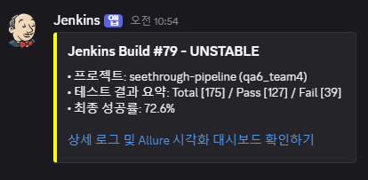
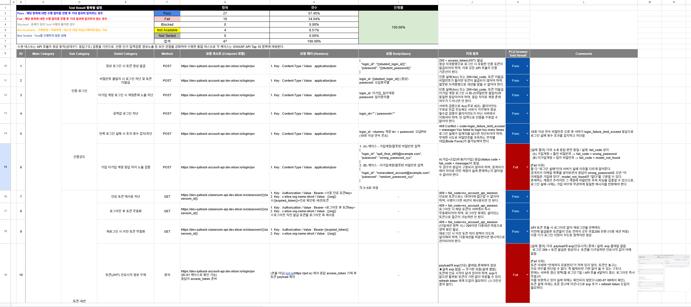
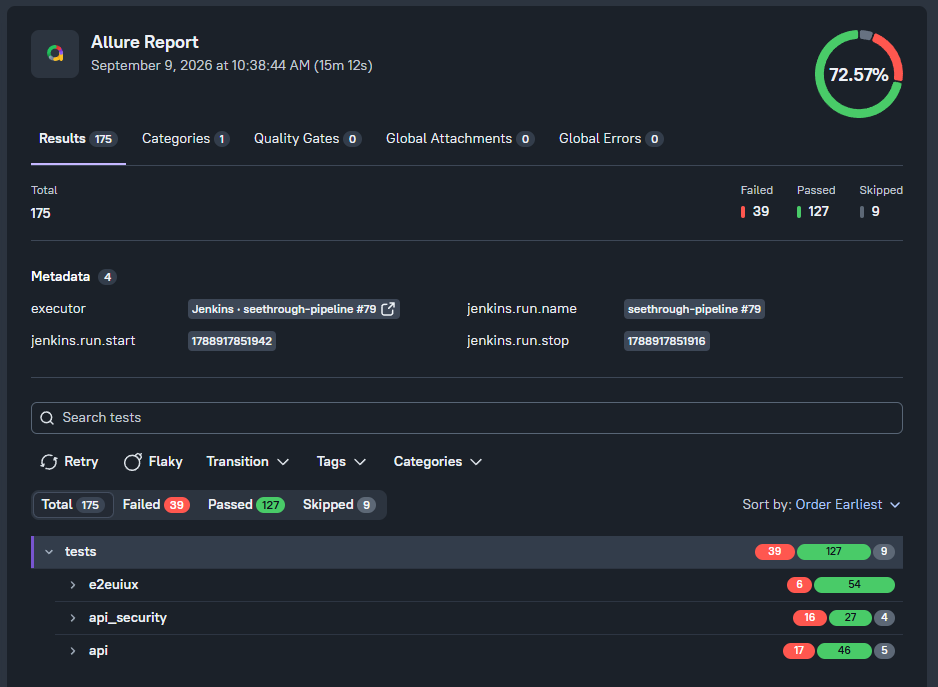
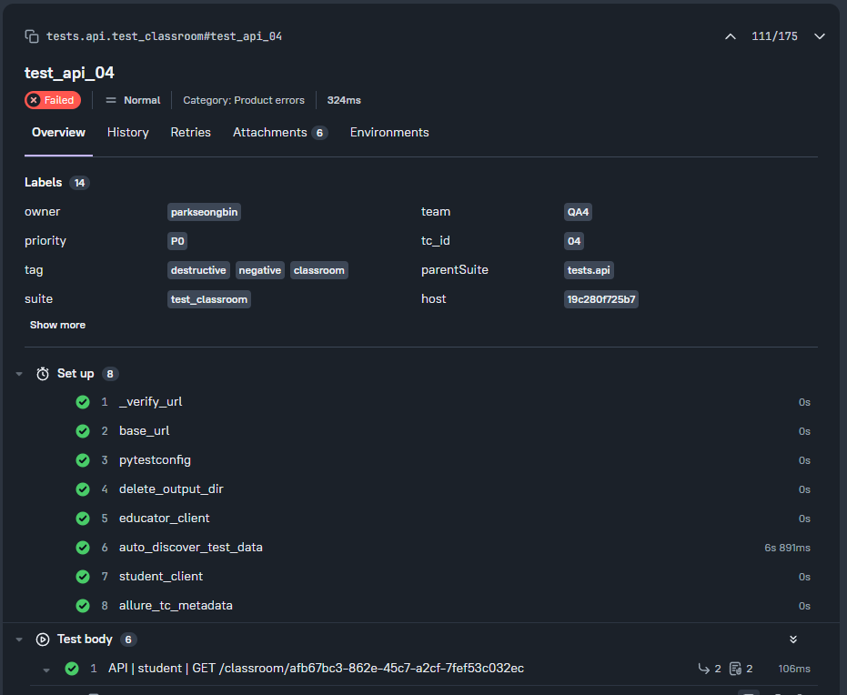
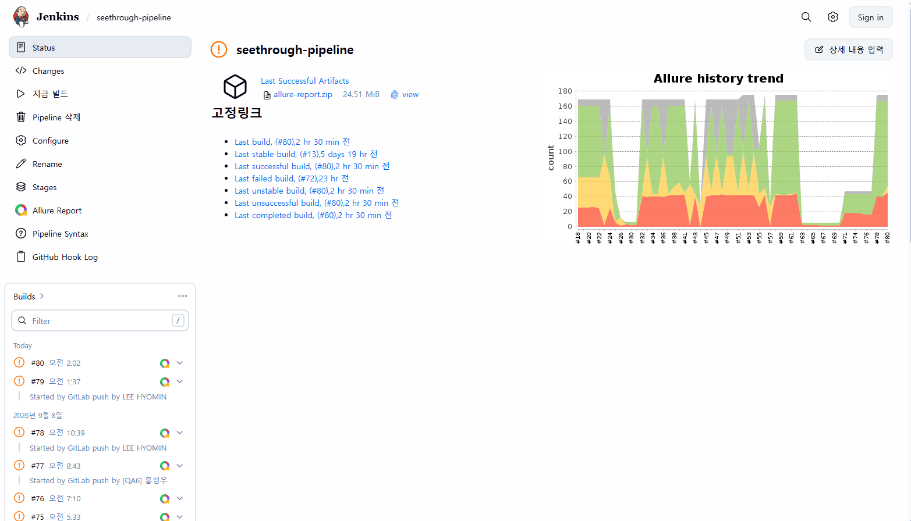

    # seethrough

## 목차

1. [프로젝트 소개](#1-프로젝트-소개)
2. [팀 구성 및 업무 분장](#2-팀-구성-및-업무-분장)
3. [기술 스택](#3-기술-스택)
4. [프로젝트 구조](#4-프로젝트-구조)
5. [코드 작성 기준](#5-코드-작성-기준)
6. [실행 환경 및 설치](#6-실행-환경-및-설치)
7. [테스트 실행 방법](#7-테스트-실행-방법)
8. [핵심 코드 스니펫](#8-핵심-코드-스니펫)
9. [CI 및 테스트 자동화 파이프라인](#9-ci-및-테스트-자동화-파이프라인)
10. [테스트 결과 및 산출물](#10-테스트-결과-및-산출물)
11. [Safety Design](#11-safety-design)
12. [트러블슈팅 및 알려진 이슈](#12-트러블슈팅-및-알려진-이슈)
13. [향후 개선 사항](#13-향후-개선-사항)
14. [참고 자료](#14-참고-자료)

---

## 1. 프로젝트 소개

### 프로젝트 목적
```
Elice LXP의 핵심 기능을 자동화 테스트로 검증하고 CI를 통해 지속적인 품질 관리를 수행한다.
```

### 테스트 대상 서비스

| 구분 | URL |
| --- | --- |
| Elice LXP(Dev)| [https://dev-qatrack-web.dev.elicer.io/lxp](https://dev-qatrack-web.dev.elicer.io/lxp) |

### 테스트 범위

Elice LXP(Dev)를 대상으로 기능, 보안, 성능 및 사용자 흐름을 검증한다. 테스트 케이스 문서에 설계된 범위는 총 191건이다.

| 테스트 영역 | TC 수 | 주요 검증 범위 |
| --- | ---: | --- |
| [API](https://docs.google.com/spreadsheets/d/19UYRMJlXTdcG8zDIy5Gt8rRAlB0yT8is74YtEo1CMWM/edit?gid=1167603962#gid=1167603962) | 68 | 클래스 홈, 학습 과목, 수업 일정, 게시판 API의 조회·생성·수정·삭제와 학습자·교육자 권한 검증 |
| [API 호출 보안](https://docs.google.com/spreadsheets/d/19UYRMJlXTdcG8zDIy5Gt8rRAlB0yT8is74YtEo1CMWM/edit?gid=1399124983#gid=1399124983) | 47 | 인증 강도, 토큰·세션, 객체 권한 우회, 권한 상승, 기관·클래스 접근 통제, 비즈니스 로직, 인젝션 및 정보 노출 검증 |
| [부하 테스트](https://docs.google.com/spreadsheets/d/19UYRMJlXTdcG8zDIy5Gt8rRAlB0yT8is74YtEo1CMWM/edit?gid=151845502#gid=151845502) | 16 | 계정·토큰 준비, 과목 조회와 시험 입장·제출·재응시 흐름, 5~30명 부하 프로필, Kill Switch와 호출 간격 검증 |
| [E2E/UI/UX](https://docs.google.com/spreadsheets/d/19UYRMJlXTdcG8zDIy5Gt8rRAlB0yT8is74YtEo1CMWM/edit?gid=1802487519#gid=1802487519) | 60 | 로그인, 클래스·과목·시험, 게시판, 수업 일정, 반응형 UI와 네트워크·중복 요청·시간 초과·HTTP 오류 등 예외 흐름 검증 |

### 프로젝트 성과

#### 자동화 테스트 결과

| 테스트 영역 | 전체 TC | Pass | Fail | Not Available | Pass 비율 |
| --- | ---: | ---: | ---: | ---: | ---: |
| API | 68 | 65 | 1 | 2 | 95.59% |
| API Security | 47 | 27 | 16 | 4 | 57.45% |
| Load | 16 | 13 | 2 | 1 | 81.25% |
| E2E/UI/UX | 60 | 53 | 7 | 0 | 88.33% |
| 전체 | 191 | 158 | 26 | 7 | 82.72% |

- 로그인, 클래스 · 과목 · 시험, 게시판, 수업 일정 등 사용자의 핵심 흐름을 E2E 테스트로 자동화하고 반응형 UI와 주요 예외 상황을 검증함
- 학습자·교육자 계정별 client를 활용해 클래스 · 과목 · 일정 · 게시판 API의 요청 · 응답과 역할별 권한을 검증함
- API Security 테스트를 통해 인증·토큰·세션, 객체 권한 우회, 권한 상승, 인젝션 및 정보 노출 등 주요 보안 위험을 검증함


* Pass 비율은 전체 TC 대비 Pass 비율이며, `Not Available`은 기획 변경·자료 부족·테스트 대상 제외 등의 사유로 별도 집계된 항목임
* `Blocked`와 `Not Tested`는 전체 영역에서 0건임

---

## 2. 팀 구성 및 업무 분장

| 팀원 | 역할 | 담당 테스트 영역 | 담당 업무 |
| --- | --- | --- | --- |
| 이효민 | 팀장 | 부하 테스트 | QA 자동화 테스트 계획서, 최종 발표 자료 작성, Jenkins CI 구축|
| 박성빈 | 팀원 | API 테스트 | API 기능 분류, 프로젝트 트러블슈팅 사례 정리 |
| 유대원 | 팀원 | API 보안 테스트 | QA(이슈) 리포트 작성, 주요 버그 리포트 선별 및 자료정리, Jenkins CI 구축 보조|
| 홍성우 | 팀원 | E2E/UI/UX 테스트 | QA 자동화 테스트 결과 보고서, README 작성 |

#### 유대원 담당 상세

- **담당 코드**: [`tests/api_security/`](tests/api_security/) — 인증·토큰/세션·권한 우회·권한 상승·접근 통제·비즈니스 로직·인젝션·정보 노출 8종 테스트
- **테스트 결과**: 47건 중 Pass 27 / Fail 16 / Not Available 4 — Fail 16건은 탐지된 결함으로 이슈 리포트에 등록
- **추가 역할**: 팀 전체 이슈 리포트 통합 관리, 위험도 높은 대표 버그 선정, Jenkins CI 구축 보조

---

## 3. 기술 스택

### 테스트 도구

| 구분 | 도구 | 용도 |
| --- | --- | --- |
| 테스트 실행 | pytest | 테스트 수집, fixture 및 실행 결과 관리 |
| UI 자동화 | Playwright | Chromium 기반 E2E/UI/UX 테스트 |
| API 테스트 | Requests | HTTP 요청 및 응답 검증 |
| 부하 테스트 | Requests, JMeter | 동시 사용자 접속 및 성능 한계 측정 |

### 언어 및 라이브러리

| 구분 | 기술 |
| --- | --- |
| 언어 | Python |
| 테스트 프레임워크 | pytest 9.1.1 |
| 브라우저 자동화 | Playwright 1.62.0, pytest-playwright 0.9.0 |
| HTTP 클라이언트 | Requests 2.34.2 |
| 테스트 리포트 연동 | allure-pytest 2.16.0 |
| 환경변수 로드 | python-dotenv 1.2.3 |

### CI/CD 및 리포트 도구

| 구분 | 도구 | 용도 |
| --- | --- | --- |
| 형상 관리 | GitLab | 소스 코드와 Merge Request 관리 |
| CI | Jenkins | checkout, 환경 구성, 테스트 실행 |
| 실행 환경 | Linux, Docker | Jenkins CI 실행 환경 |
| 리포트 | Allure Report | 테스트 결과와 실패 증거 시각화 |
| 알림 | Discord | Jenkins 빌드 결과 알림 |

---

## 4. 프로젝트 구조

```text
seethrough/
├── Jenkinsfile                   # 기본 테스트 CI 파이프라인
├── Jenkinsfile.api               # API 테스트 CI 파이프라인
├── Jenkinsfile.api_security      # API Security 테스트 CI 파이프라인
├── Jenkinsfile.e2euiux           # E2E/UI/UX 테스트 CI 파이프라인
│
├── tests/                        # 테스트 케이스
│   ├── api/                      # 클래스, 과목, 일정, 게시판 API 테스트
│   ├── api_security/             # 인증, 권한, 세션 및 웹 보안 테스트
│   ├── e2euiux/                  # Playwright 기반 E2E/UI/UX 테스트
│   └── loadtest/                 # 경량 부하 및 안전성 통제 테스트
│
├── framework/                    # 테스트 지원 코드
│   ├── api/                      # API 영역별 요청 클라이언트
│   ├── api_security/             # API Security 요청 객체, 토큰 및 명세 비교 기능
│   ├── e2euiux/                  # E2E 공통 flow와 페이지 객체(POM)
│   │   └── pages/                # 페이지별 POM
│   └── loadtest/                 # 부하 테스트 클라이언트, pacing, 리포트 및 Kill Switch
│
├── clients/                      # API와 API Security가 함께 사용하는 기본 HTTP 클라이언트
├── config/                       # 환경변수 로드와 공통 설정
├── data/                         # API 명세, 요청 payload와 테스트 데이터
├── utils/                        # API 계열 assertion, Allure, 데이터 준비 및 공통 유틸리티
├── scripts/                      # HAR 요약 생성 등 테스트 지원 스크립트
│
├── docs/                         # 문서 및 테스트 산출물
│   ├── images/                   # README 이미지
│   └── bug_videos/               # README 표시할 재현 영상
│
├── .env.sample                   # 테스트 실행에 필요한 환경변수 예시
├── pytest.ini                    # pytest 옵션과 marker 등록
├── requirements.txt              # Python 패키지 의존성
└── README.md                     # 프로젝트 문서
```


### 테스트 영역별 구성

<details>
<summary>테스트 영역별 구성 보기</summary>

| 테스트 영역 | 테스트 경로 | Framework/Client | 구성 |
| --- | --- | --- | --- |
| E2E/UI/UX | `tests/e2euiux/` | `framework/e2euiux/` | 사용자 흐름, 예외 상황, 반응형 UI 검증 |
| API | `tests/api/` | `framework/api/`, `clients/` | 클래스, 과목, 일정, 게시판 API 검증 |
| API Security | `tests/api_security/` | `framework/api_security/`, `clients/` | 인증, 세션, 객체 권한 우회, 권한상승, 인젝션 검증 |
| Load | `tests/loadtest/` | `framework/loadtest/` | 단계별 동시 사용자와 안전성 통제 검증 |

</details>

---

## 5. 코드 작성 기준

### E2E POM 기준

<details>
<summary>E2E POM 기준 보기</summary>

| 구분 | 위치 | 기준 |
| --- | --- | --- |
| Page Object | `framework/e2euiux/pages/` | 페이지별 locator, 동작과 화면 검증 관리 |
| Flow | `framework/e2euiux/flows.py` | 여러 페이지에서 반복되는 공통 절차 관리 |

</details>

### fixture 사용 기준

<details>
<summary>Fixture 사용 기준 보기</summary>

| 테스트 영역 | 주요 fixture | 사용 기준 |
| --- | --- | --- |
| 공통 | 각 영역의 `conftest.py` | 반복되는 사전조건과 자원 생명주기를 관리하고 테스트 함수에는 검증 흐름만 유지 |
| API | 사용자별 client, `payloads`, 자동 데이터 탐색 | 여러 TC에서 재사용하는 인증 client와 payload는 `session` scope로 관리 |
| API Security | 사용자별 token과 client | 토큰·세션 간 상태 간섭을 줄이기 위해 기본적으로 함수 단위로 준비 |
| E2E/UI/UX | 계정, 브라우저 context, 시험 초기화 | 계정은 `session`, 연속 flow는 `module`, 독립 상태와 초기화는 `function` scope로 관리 |
| Load | `accounts` | 전체 부하 시나리오에서 사용할 계정 목록을 `session` scope로 한 번 로드 |
| 종료 처리 | 생성 데이터, 브라우저 context와 외부 자원 | fixture에서 생성한 자원은 가능한 경우 `yield` 이후 정리하고 테스트 간 영향을 최소화 |

</details>


### Allure 메타데이터

| 구분 | 적용 기준 |
| --- | --- |
| `tc_id` | Google Sheet TC와 자동화 결과 연결 |
| `priority` | `P0`, `P1`, `P2` 중요도 구분 |
| `owner` | 테스트 담당자 표시 |
| `team` | 담당 팀 표시 |
| Allure title/feature | API Security 테스트의 기능과 목적 표시 |


---

## 6. 실행 환경 및 설치

### 지원 환경

| 구분 | 운영체제 | 실행 환경 | 브라우저 |
| --- | --- | --- | --- |
| 로컬 | Windows 11 | Python 가상환경 | Playwright Chromium |
| CI | Linux | Docker 기반 Jenkins | Playwright Chromium |

### 가상환경

프로젝트 루트에서 Python 가상환경을 만들고 활성화합니다. (로컬 Windows 기준)

```powershell
python -m venv venv
.\venv\Scripts\Activate.ps1
```

### 패키지 설치

```bash
python -m pip install -r requirements.txt
```

### Playwright 브라우저 설치

```bash
python -m playwright install chromium
```

### 환경변수 설정

`.env.sample`을 참고해 프로젝트 루트에 `.env`를 준비합니다. 실제 계정, 비밀번호와 토큰은 저장소에 커밋하지 않습니다.

```powershell
Copy-Item .env.sample .env
```

CI의 민감정보는 `Jenkins Credentials`를 통해 주입하는 방식입니다.

---

## 7. 테스트 실행 방법

### 전체 실행

```bash
pytest
```

기본 `pytest` 실행에는 E2E/UI/UX, API, API Security가 포함되며 부하 테스트는 포함되지 않습니다.

### 영역별 실행

| 영역 | 명령어 |
| --- | --- |
| E2E/UI/UX | `pytest tests/e2euiux -v` |
| API | `pytest tests/api -v` |
| API Security | `pytest tests/api_security -v` |
| Load | `pytest tests/loadtest -v -s` |

### marker 실행

```bash
pytest -m exam_flow -v
pytest -m board -v
pytest -m sec_auth_login -v
pytest tests/loadtest -m load_safety -v -s
```

사용 가능한 marker는 `pytest.ini`에서 확인합니다.

### 영상 녹화

| 옵션 | 설명 |
| --- | --- |
| `--video=on` | 모든 Playwright 테스트 영상 저장 |
| `--video=retain-on-failure` | 실패한 E2E flow 영상만 보존 |

영상은 `videos/<테스트 모듈명>/`에 저장되며 실패 결과는 Allure에 첨부됩니다.

### Allure 리포트 생성

```bash
pytest -v --alluredir allure-results --clean-alluredir
allure serve allure-results
```

### 주요 옵션

| 옵션 | 설명 |
| --- | --- |
| `-v` | 테스트 이름과 결과를 자세히 표시 |
| `--headed` | Playwright 브라우저 화면 표시 |
| `--slowmo 500` | Playwright 동작 사이에 500ms 지연 적용 |
| `--video=retain-on-failure` | 실패한 E2E flow 영상 보존 |
| `--alluredir allure-results` | Allure 원본 결과 저장 경로 지정 |
| `--clean-alluredir` | 실행 전 기존 Allure 원본 결과 삭제 |

통합 실행 예시:

```bash
pytest -v --alluredir allure-results --clean-alluredir --video=retain-on-failure --headed --slowmo 500
```

---

## 8. 핵심 코드 스니펫

<details>
<summary>API</summary>

클래스 조회 API의 HTTP 성공 여부와 주요 응답 필드를 검증합니다.

```python
def test_api_01(student_client):
    require_values(CLASSROOM_ID=settings.CLASSROOM_ID)
    data = assert_success(
        ClassroomClient(student_client).get_classroom(
            settings.CLASSROOM_ID
        )
    )
    assert str(data.get("id")) == str(settings.CLASSROOM_ID)
    assert data.get("name") not in (None, "")
    assert "description" in data
```

</details>

<details>
<summary>API Security</summary>

토큰 payload의 사용자 id를 타인 값으로 변조해 타인 데이터 접근을 시도하고, 차단 여부를 검증합니다.

```python
@allure.title("ID-14 토큰 ID 변조로 타인 데이터 접근 차단")
def test_id14_payload_id_변조_차단(self, account_client):
    token = account_client.get_access_token(STUDENT_ID, STUDENT_PW)
    tampered = token_utils.tamper_payload(
        token, _id=OTHER_STUDENT_ID, account_id=OTHER_STUDENT_ID
    )
    client = APIClient(token=tampered, role="probe")
    response = client.get(
        f"{DASHBOARD_URL}/student/{OTHER_STUDENT_ID}",
        params={"classroom_id": CLASSROOM_ID},
    )

    assert_business_rejected(response, context="_id 변조 토큰 타인 데이터 접근")
```

</details>

<details>
<summary>E2E/UI/UX</summary>

Allure Label과 POM을 이용해 게시물 작성 흐름을 검증합니다.

```python
@allure.label("tc_id", "46")
@allure.label("priority", "P2")
def test_limit_board_title(board_title_page):
    """게시물 제목 최대 길이 확인"""
    board_write_page = BoardWritePage(board_title_page)
    board_write_page.fill_title(TITLE_VALUE)
    board_write_page.append_title("test")
    board_write_page.verify_title_limit(TITLE_VALUE)
```

</details>

<details>
<summary>Load</summary>

HTTP 500을 감지하면 Kill Switch로 부하 실행을 중단합니다. 가상 유저 기동은 Ramp-up 1초, API·단계 사이는 3~5초 think time을 사용합니다.

```python
from framework.loadtest.pacing import ramp_up_wait, think_time

ramp_up_wait(user_index, user_count)
client = LoadClient(session=SafetySession(session))

try:
    login_response = client.auth.login(login_id, password)
    think_time()
    course_response = client.course.get_course()
except SafetyKillSwitchError as error:
    return False, str(error)
```

</details>

---

## 9. CI 및 테스트 자동화 파이프라인

### 전체 실행 순서

```
┌──────────────────────┐
│ GitLab Push / Merge  │
└──────────┬───────────┘
           │ Webhook
           ▼
┌─────────────────────────────────────────┐
│ Jenkins CI (Docker)                     │
│                                         │
│ [1 Checkout]                            │
│       ↓                                 │
│ [2 Environment Setup]                   │
│    venv · requirements · Chromium       │
│    Credentials                          │
│       ↓                                 │
│ [3 Test Execution]                      │
│    E2E/UI/UX · API · API_SECURITY       │
│    Load 테스트는 별도 실행              │
└──────────────────┬──────────────────────┘
                   ▼
          ┌────────────────────┐
          │ [4 Allure Report]  │
          │ allure-results     │
          │ junit-report.xml   │
          └─────────┬──────────┘
                    ▼
          ┌────────────────────┐
          │ Discord 결과 알림   │
          │ 결과 요약 · 링크     │
          └────────────────────┘
```

### GitLab 자동 빌드 조건

- GitLab Push Event 발생 시 Webhook을 통해 Jenkins 파이프라인을 자동 실행한다.
- 브랜치 범위는 GitLab Webhook 및 Jenkins 작업 설정에 따른다.


### Jenkins Credentials

- CI 실행에 필요한 테스트용 계정·토큰 등 민감정보는 Jenkins Credentials에서 관리하고 실행 시 환경변수로 주입한다.<br>로컬에서는 `.env.sample`을 참고해 `.env`를 구성한다.

- 실제 자격증명은 Git, README, Discord 메시지, Allure 첨부와 실행 로그에 기록하지 않는다.

### Allure 및 Discord 연동

- pytest 결과를 Allure 원본과 JUnit 형식으로 저장하고 Jenkins에서 Allure 리포트로 게시한다
- Jenkins 빌드 완료 후 테스트 요약과 상세 리포트 링크를 Discord로 전송한다



---

## 10. 테스트 결과 및 산출물

| 항목 | 결과 및 이미지 |
| --- | --- |
| TC 문서 | 상세 자료에 포함 |
| Allure 리포트 | 상세 자료에 포함 |
| Jenkins 실행 결과 | 상세 자료에 포함 |
| 결함 및 영상 증거 | 상세 자료에 포함 |

<details>
<summary>테스트 결과 상세 자료 보기</summary>

#### TC 문서



#### Allure 리포트





#### Jenkins 실행 결과



#### 결함 및 영상 증거


</details>

---

## 11. Safety Design

| 안전 항목 | 적용 기준 |
| --- | --- |
| 동시성 및 호출 빈도 제한 | `ThreadPoolExecutor(max_workers=target_users)`로 동시 사용자 수를 5·10·20·30명으로 제한함. `ramp_up_wait`로 1초 동안 가상 사용자 기동을 분산하고, API·단계 사이에는 3~5초 `think_time`과 단계별 대기를 적용해 순간 호출을 완화함 |
| 부하 테스트 분리 | 기본 `pytest`에서 `tests/loadtest`를 제외하고 별도 명령과 담당자를 통해 실행 |
| 재시도 및 Kill Switch | 테스트 결과를 숨기지 않도록 자동 재시도는 적용하지 않음. `SafetySession`이 HTTP 500을 감지하면 해당 가상 사용자 흐름을 즉시 중단하고, 중단 사유와 에러율을 Allure에 기록함. 에러율이 1%를 초과하면 테스트를 실패 처리함 |
| 민감정보 관리(환경변수·Jenkins Credentials) | `.env`를 Git에서 제외하고 실패 로그의 계정 정보를 마스킹함. 로컬은 환경변수 또는 `.env`, CI는 Jenkins Credentials로 값을 주입함 |
| 테스트 데이터 정리 | 자동 생성 데이터는 세션 종료 시 정리하고, 변경·삭제 테스트는 `destructive` marker로 구분 |


---

## 12. 트러블슈팅 및 알려진 이슈

| 테스트 영역 | 이슈 | 현상 | 확인 및 대응 |
| --- | --- | --- | --- |
| API | 다중 계정 API Session 문제 (ID-60·61·67) | 수강생 A와 B를 함께 사용하는 권한 테스트에서 일정 시간이 지나면 B계정 요청이 `no_account_api_session` 응답으로 검증 단계에 도달하지 못하고 SKIP 처리됨 | `eliceSessionKey`와 계정 API Session을 구분하고, 테스트 전 A·B 계정의 로그인 및 Session 유효성을 확인함. Session 미확보는 제품 기능 실패가 아닌 사전조건 미충족으로 분리하고, ID-60·61·67은 A가 생성한 리소스에 B가 접근하는 구조로 검증함 |
| API_SECURITY | 로컬 통과 / CI만 실패 Credential 보이지 않는 문자 (ID-30) | 로컬에서는 정상이나 Jenkins에서 토큰 발급이 실패함. bash로 직접 source한 Credential 값 끝에 CRLF(`\r`) 또는 공백이 섞인 것이 유력 원인으로 판단됨 | `os.getenv()` 결과에 `.strip()`을 적용하고 Jenkins 빌드 재실행 후 통과를 확인함 |
| E2E/UI/UX | 로그인 세션 끊김 및 재로그인 페이지 전환 | 로그인 후 LXP 메인 페이지 대신 재로그인 페이지 `accounts/signin/history`로 이동해 후속 테스트가 실패할 수 있음 | 최종 URL과 인증 응답 상태를 확인하고, 재로그인 페이지면 기록 삭제 후 로그인 페이지로 돌아가 정보를 다시 입력해 메인 페이지 표시 여부를 확인함 |
| LOAD | 안정성 통제 기준에 따른 부하테스트 실패 | 테스트 케이스 설계 단계에서 모든 테스트 스텝에 `Latency < 5,000ms` Time-Out 통제를 적용했으나, 부하테스트에서 주요 실패 원인으로 작용해 대부분의 케이스가 실패함 | 부하테스트에서 해당 통제를 완화한 뒤 재실행했고, 테스트 성공을 확인함 |

---

## 13. 향후 개선 사항

| 개선 영역 | 향후 개선 내용 | 기대 효과 |
| --- | --- | --- |
| 테스트 데이터·세션 격리 | 테스트 전용 계정과 데이터를 자동으로 준비·회수하고, 다중 계정 테스트 전 A·B 계정의 Session 상태를 자동 점검함 | 테스트 간 간섭과 사전조건 미충족에 따른 SKIP을 줄임 |
| 부하 테스트 보완 및 지표 관리 | Requests·JMeter 시나리오를 예약 실행하고, 동시 사용자 수·Latency·에러율 추이를 누적 관리함 | 성능 저하와 오류율 증가를 조기에 감지함 |
| E2E 품질 범위 확대 | 주요 사용자 흐름의 브라우저·해상도 조합을 확대하고 예외 케이스를 보완함 | 브라우저·화면 크기와 예외 상황에서 발생하는 오류를 조기에 발견하여 사용자 환경별 안정성을 향상함 |
| 테스트 병렬 실행 | API·API_SECURITY·E2E 테스트를 독립적인 그룹 단위로 병렬 실행하고, 계정·테스트 데이터·Allure 결과를 분리함 | 전체 테스트 실행 시간을 단축하고 CI 피드백 속도를 향상함 |

---

## 14. 참고 자료

| 구분 | 참고 문서 | 활용 내용 |
| --- | --- | --- |
| 테스트 프레임워크 | [pytest 공식 문서](https://docs.pytest.org/en/stable/) | 테스트 실행, fixture, marker 및 pytest hook |
| E2E/UI 자동화 | [Playwright Python 공식 문서](https://playwright.dev/python/docs/intro) | 브라우저 제어, locator, assertion 및 테스트 실행 |
| API 테스트 | [Requests 공식 문서](https://docs.python-requests.org/en/stable/) | HTTP 요청, 인증, 세션 및 응답 처리 |
| API 보안 설계 | [OWASP API Security Top 10 2023](https://owasp.org/API-Security/editions/2023/en/0x11-t10/) | 인증, 객체 권한, 자원 소비, 비즈니스 흐름 및 보안 설정 위험 기반 테스트 설계 |
| 부하 테스트 | [Requests 공식 문서](https://docs.python-requests.org/en/stable/), [Apache JMeter 공식 문서](https://jmeter.apache.org/usermanual/) | Requests 기반 HTTP 요청·세션 처리와 JMeter 기반 Ramp-up 및 동시 사용자 부하 시나리오 검증 |
| 테스트 리포트 | [Allure Report 공식 문서](https://allurereport.org/docs/) | pytest 결과 수집, 첨부 파일 및 HTML 리포트 생성 |
| CI 파이프라인 | [Jenkins Pipeline 공식 문서](https://www.jenkins.io/doc/book/pipeline/) | Jenkinsfile 기반 테스트 실행과 결과 게시 |
| 자동 빌드 트리거 | [GitLab Webhooks 공식 문서](https://docs.gitlab.com/user/project/integrations/webhooks/) | Push Event와 Jenkins Webhook 연동 |
| 실행 환경 | [Docker 공식 문서](https://docs.docker.com/get-started/) | Jenkins와 테스트 실행 환경의 컨테이너 구성 |
